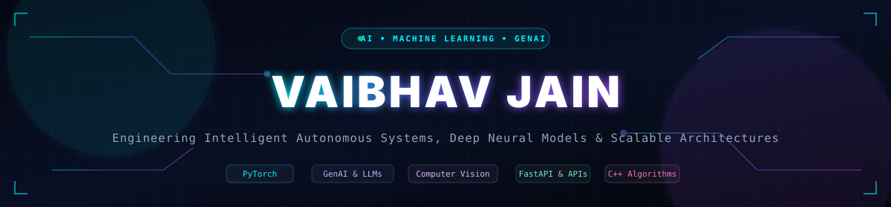
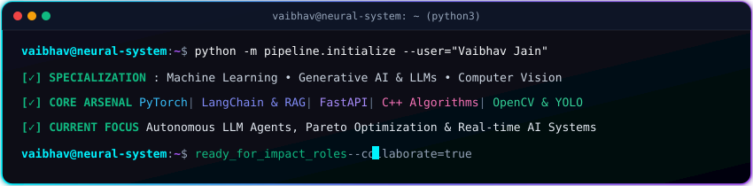

  <!-- Bespoke Cyber Hero Banner -->
  

    

  <!-- Interactive Terminal HUD Cockpit -->
  

    

  <!-- Telemetry Counter -->
  

---

### 🛰️ Executive Identity & Engineering Ethos

- 🎓 **Specialization**: Computer Science & Engineering (AI/ML)
- 🧠 **Research & Core Focus**: Deep Learning architectures, Generative AI & LLMs, RAG pipelines, and Multimodal Vision
- 📊 **Optimization Pioneer**: Engineering predictive frameworks evaluating Pareto-optimal trade-offs between accuracy, latency, and compute overhead
- ⚡ **Algorithmic Rigor**: Designing optimized C++ data structures, graph theory algorithms, and dynamic programming solutions
- 🛠️ **Production Ready**: Architecting asynchronous microservices with FastAPI, Docker, and scalable RESTful backends
- 💡 **Mission**: *"Transforming complex mathematical intelligence into robust, high-throughput autonomous software."*

---

### 🚀 Flagship Innovations & Repositories

<table>
  <tr>
    <td width="50%" valign="top">
      <h3 align="center">🤖 ET-Hackathon GenAI Concierge</h3>
      

        
      

      <ul>
        <li>Context-grounded conversational concierge powered by Large Language Models and prompt chaining.</li>
        <li>Dynamic vector retrieval, multi-turn memory, and low-latency API response pipelines.</li>
        <li>Engineered specifically for real-time hackathon evaluation criteria.</li>
      </ul>
      

        <code>Python</code> • <code>LLMs</code> • <code>Prompt Engineering</code> • <code>RAG</code> • <code>FastAPI</code>
      

    </td>
    <td width="50%" valign="top">
      <h3 align="center">📊 Predictive Multi-Objective Compression</h3>
      

        
      

      <ul>
        <li>ML-driven predictive framework evaluating compression algorithms along the Pareto frontier.</li>
        <li>Automates trade-off analysis between compression ratio, CPU runtime, and memory utilization.</li>
        <li>Eliminates expensive trial-and-error benchmarking on heterogeneous data streams.</li>
      </ul>
      

        <code>Python</code> • <code>Machine Learning</code> • <code>Pareto Optimization</code> • <code>Scikit-Learn</code>
      

    </td>
  </tr>
  <tr>
    <td width="50%" valign="top">
      <h3 align="center">📝 College Feedback &amp; Sentiment Classifier</h3>
      

        
      

      <ul>
        <li>End-to-end NLP pipeline categorizing unstructured institutional feedback into departmental channels.</li>
        <li>Extracts sentiment polarity scores and trending topic clusters for automated administrative insights.</li>
        <li>Combines TF-IDF feature matrices with multi-class supervised models.</li>
      </ul>
      

        <code>NLP</code> • <code>Python</code> • <code>Scikit-Learn</code> • <code>Sentiment Analysis</code> • <code>Jupyter</code>
      

    </td>
    <td width="50%" valign="top">
      <h3 align="center">⚡ High-Performance DSA &amp; Algorithmic Suite</h3>
      

        
      

      <ul>
        <li>Optimized, production-quality C++ implementations of advanced data structures.</li>
        <li>Time and space complexity optimized solutions for graph theory, segment trees, and dynamic programming.</li>
        <li>Zero memory leaks, modular design, and asymptotic performance guarantees.</li>
      </ul>
      

        <code>C++</code> • <code>Graph Theory</code> • <code>Dynamic Programming</code> • <code>Data Structures</code>
      

    </td>
  </tr>
</table>

---

### 🛠️ Technical Arsenal & Stack

| Domain | Technologies &amp; Tooling |
| :--- | :--- |
| **AI, ML &amp; Deep Learning** |       |
| **Generative AI &amp; LLMs** |      |
| **Core Languages** |       |
| **Backend &amp; Microservices** |      |
| **Databases &amp; DevOps** |       |

---

### 🗓️ Contributions Matrix &amp; 3D City

  <!-- 3D Isometric Contribution City generated via GitHub Actions (city.yml) -->
  

  
  

---

### 🌌 Celestial Planetary Top Languages

  

---

### 🌐 Connect &amp; Collaborate

  
  &nbsp;&nbsp;
  
  &nbsp;&nbsp;
  
  &nbsp;&nbsp;
  

 

  ⚡ Designed &amp; Engineered with precision by <b>Vaibhav Jain</b> • Built for the frontier of AI

