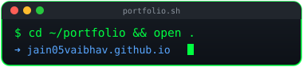
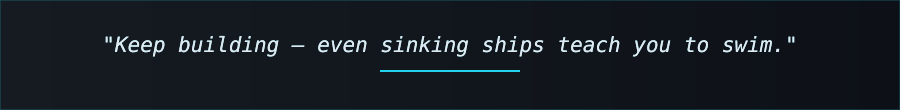

  

  

## 📌 About Me
- 🎓 B.Tech Computer Science & Engineering (AI/ML)
- 🐛 Professional bug creator, occasional bug fixer
- ☕ Turning tea into code since sophomore year
- 🧠 Deep into AI/ML & LLMs, always chasing the next paper or framework to break
- 💻 Equally at home shipping SDE / full-stack web dev work when the vibe calls for it
- 🚀 Perpetually learning, perpetually one Stack Overflow tab away from disaster
- 🌐 Have a look 😎: [jain05vaibhav.github.io](https://jain05vaibhav.github.io)

 

## 🧠 My Focus Areas
- Artificial Intelligence & Machine Learning
- Generative AI, Large Language Models (LLMs) & RAG Systems
- Autonomous Agents & Multi-Turn Conversational Architectures
- Computer Vision & Speech Intelligence
- Full-Stack / Web Development & Scalable Backend APIs
- High-Performance C++ & Algorithmic Problem Solving
- Whatever new tech breaks my brain this month

 

## 🗓️ Contributions Calendar

  

  
  

 

## 🛠️ Languages & Tools

<h3 align="center">Programming Languages</h3>

  &nbsp;&nbsp;&nbsp;
  &nbsp;&nbsp;&nbsp;
  &nbsp;&nbsp;&nbsp;
  &nbsp;&nbsp;&nbsp;
  &nbsp;&nbsp;&nbsp;
  

<h3 align="center">AI, Machine Learning &amp; GenAI</h3>

  &nbsp;&nbsp;&nbsp;
  &nbsp;&nbsp;&nbsp;
  &nbsp;&nbsp;&nbsp;
  &nbsp;&nbsp;&nbsp;
  &nbsp;&nbsp;&nbsp;
  

<h3 align="center">Frontend</h3>

  &nbsp;&nbsp;&nbsp;
  &nbsp;&nbsp;&nbsp;
  &nbsp;&nbsp;&nbsp;
  &nbsp;&nbsp;&nbsp;
  

<h3 align="center">Backend</h3>

  &nbsp;&nbsp;&nbsp;
  &nbsp;&nbsp;&nbsp;
  &nbsp;&nbsp;&nbsp;
  

<h3 align="center">Database</h3>

  &nbsp;&nbsp;&nbsp;
  &nbsp;&nbsp;&nbsp;
  

<h3 align="center">DevOps &amp; Cloud</h3>

  &nbsp;&nbsp;&nbsp;
  &nbsp;&nbsp;&nbsp;
  

<h3 align="center">Tools</h3>

  &nbsp;&nbsp;&nbsp;
  &nbsp;&nbsp;&nbsp;
  &nbsp;&nbsp;&nbsp;
  &nbsp;&nbsp;&nbsp;
  

 

  <!-- Celestial Planetary Top Languages Galaxy Graphic -->
  

 

## 🔗 Connect with Me

  &nbsp;&nbsp;&nbsp;&nbsp;
  &nbsp;&nbsp;&nbsp;&nbsp;
  

 

  <!-- Animated Pacman Eating Ghosts Footer Line -->
  

